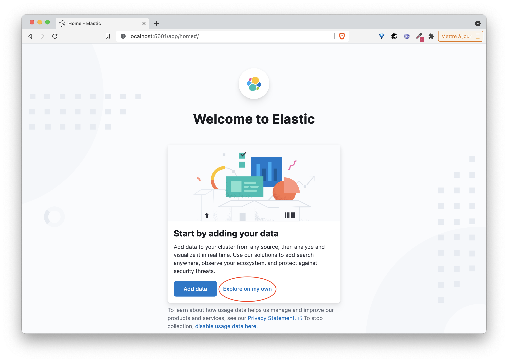
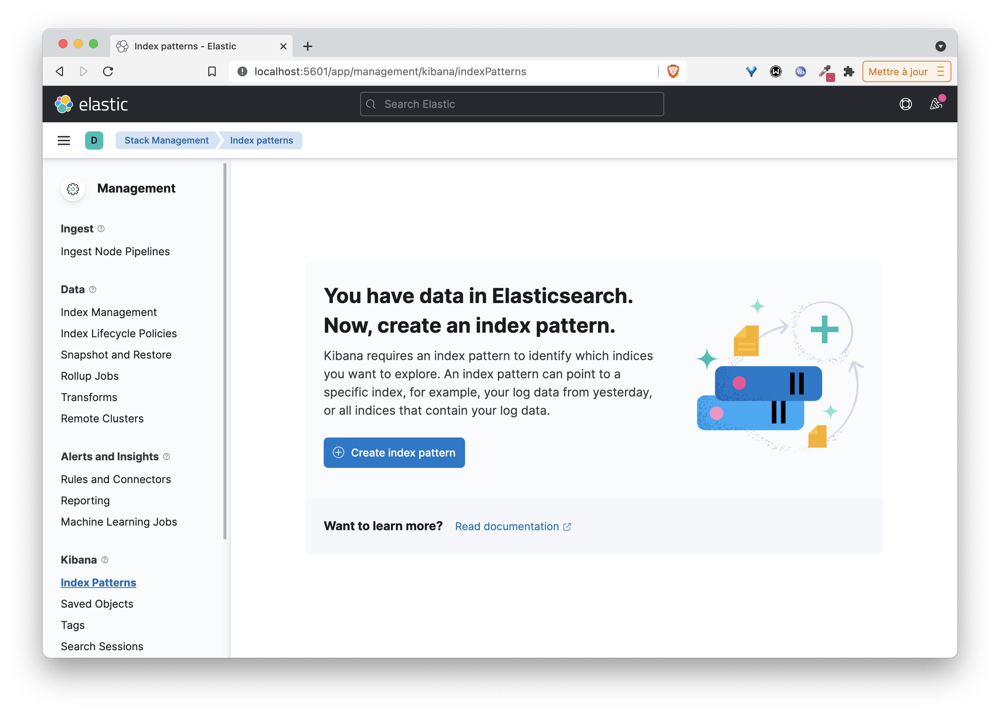
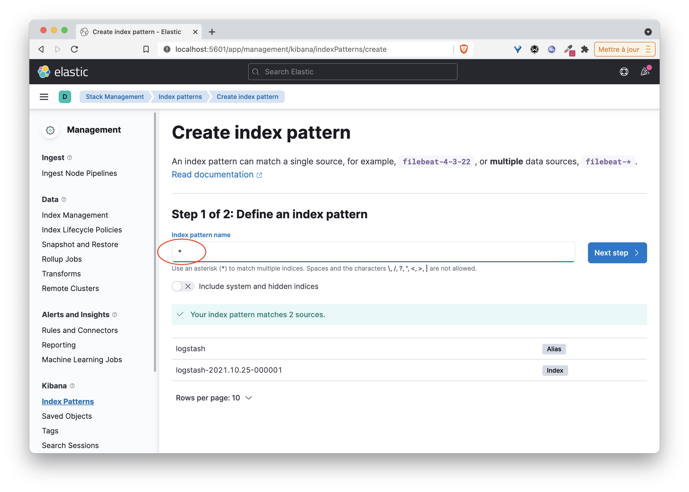
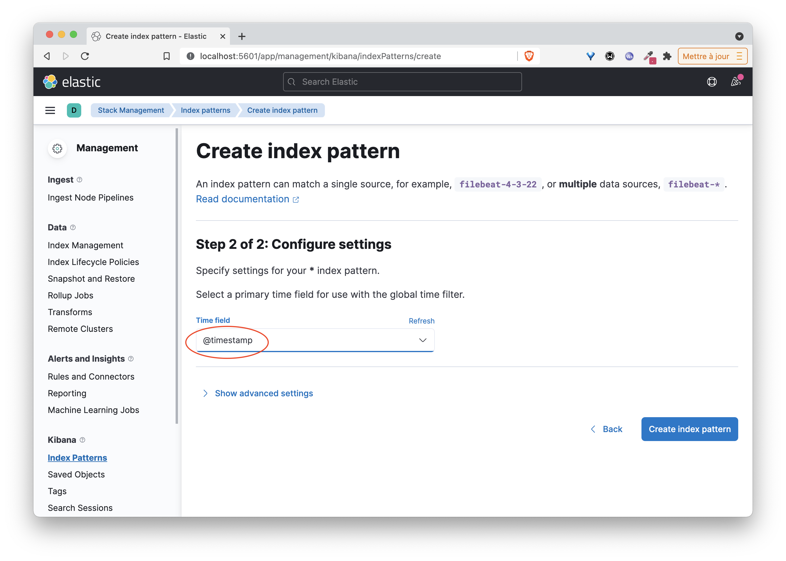
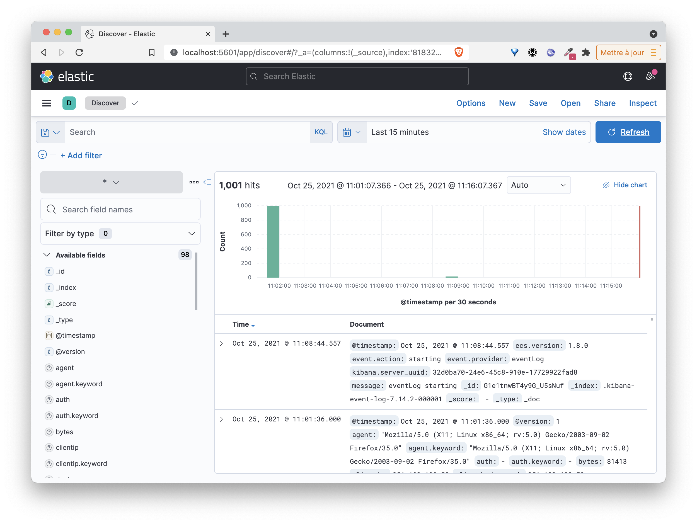
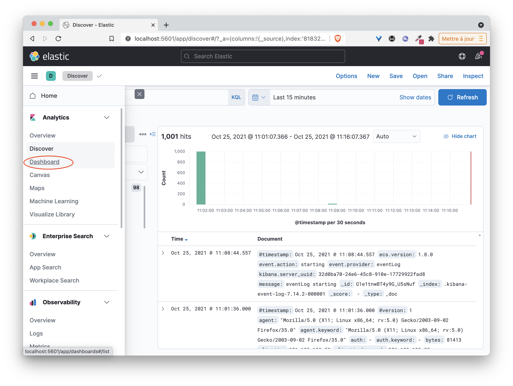
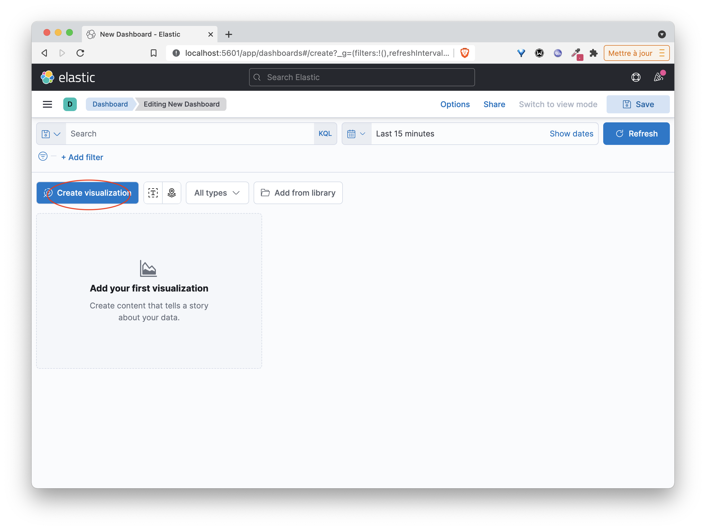
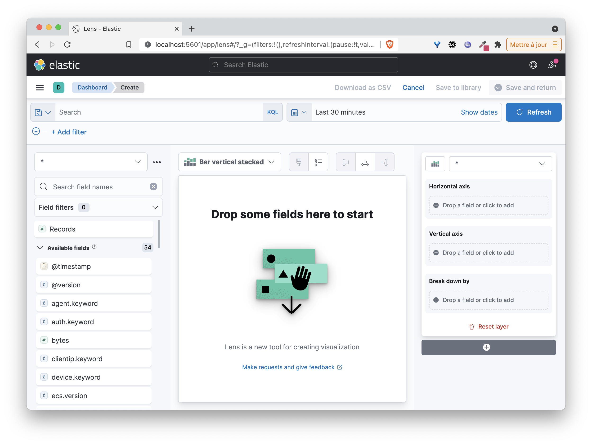
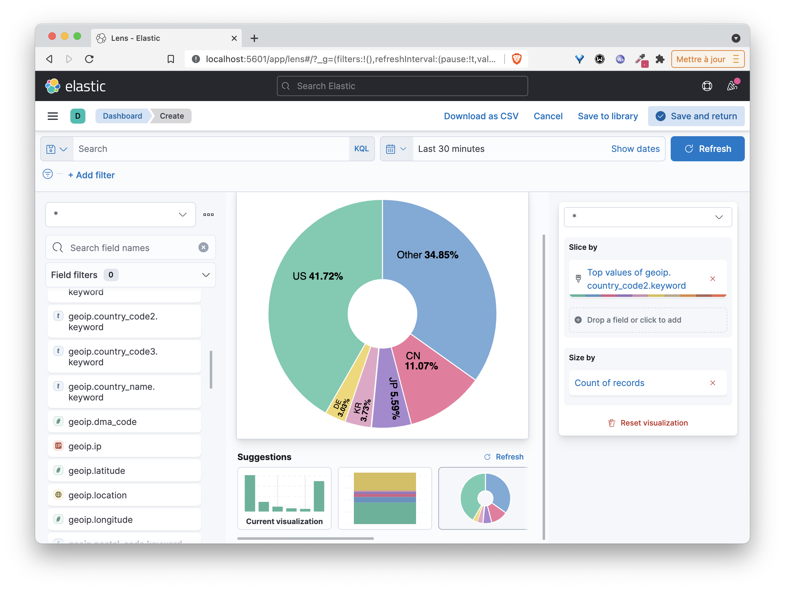

# The ELK (Elastic) stack

This stack is often used to ingest and index logs. It is composed of 3 softwares:
* Logstash which allows to filter / format incoming data and to send them to Elasticsearch (and to other applications)
* Elasticsearch, the engine responsible for indexing the data
* Kibana, the web application for data visualization

## The goal of this example

In this example, we will use Docker Compose to launch an ELK stack by configuring Logstash to :
- receive log entries on an HTTP endpoint
- extract the field present in each entry and add reverse geocoding information
- send each row to Elasticsearch

The Kibana interface will allow us to view the logs and create dashboards.

Note: we will consider that the log files are generated by a web server like apache / nginx, this will be useful to specify how Logstash should perform the parsing.

## Definition of the application in a Compose file

In order to define our ELK stack, create a directory *elk* and inside it, the file *compose.yml* with the following content:

```
services:
  logstash:
    image: logstash:7.14.2
    environment:
      discovery.seed_hosts: logstash
      LS_JAVA_OPTS: "-Xms512m -Xmx512m"
    volumes:
      - ./logstash.conf:/config/logstash.conf
    command: ["logstash", "-f", "/config/logstash.conf"]
    ports:
      - 8080:8080
  elasticsearch:
    image: elasticsearch:7.14.2
    environment:
      discovery.type: single-node
      ES_JAVA_OPTS: "-Xms512m -Xmx512m"
  kibana:
    image: kibana:7.14.2
    ports:
      - 5601:5601
```

Notes:
- The Logstash service is based on the official logstash:7.14.2 image.
We specify, under the volumes key, that the configuration file logstash.conf present in the directory is mounted on /config/logstash.conf in the container. It will be taken into account by Logstash at startup
- The Kibana service is based on the official kibana:7.14.2 image. The port mapping will allow the web interface to be available on port 5601 of the host machine.

## Logstash configuration file

First of all we will define a configuration file for Logstash. In the *elk* directory (where the compose.yml file is located), create the *logstash.conf* file with the following contents

```
input {
 http {}
}

filter {
 grok {
   match => [ "message" , "%{COMBINEDAPACHELOG}+%{GREEDYDATA:extra_fields}"]
   overwrite => [ "message" ]
 }
 mutate {
   convert => ["response", "integer"]
   convert => ["bytes", "integer"]
   convert => ["responsetime", "float"]
 }
 geoip {
   source => "clientip"
   target => "geoip"
   add_tag => [ "nginx-geoip" ]
 }
 date {
   match => [ "timestamp" , "dd/MMM/YYYY:HH:mm:ss Z" ]
   remove_field => [ "timestamp" ]
 }
 useragent {
   source => "agent"
 }
}

output {
 elasticsearch {
   hosts => ["elasticsearch:9200"]
 }
 stdout { codec => rubydebug }
}
```

This file may seem a bit complicated. It can be divided into 3 parts:
* input: allows to specify the input data. We specify here that Logstash can receive data (log entries) on http

* filter: allows to specify how the input data should be processed before going to the next step. Several statements are used here:
  * grok allows you to specify how each input should be parsed. Many parsers are available by default and we specify here (with COMBINEDAPACHELOG) that each line should be parsed according to an apache log format, this will allow an automatic extraction of fields like creation time, request url, origin ip, return code, ...
  * mutate allows to convert the types of some fields
  * geoip allows you to obtain geographical information from the original IP address
  * date is used here to reformat the timestamp

* output: allows you to specify the destination of the data once it has passed through the filter stage

## Launching the ELK stack

You can then launch the stack with the following command

```
docker compose up -d
```

Once the images have been retrieved from the Docker Hub, it may take a few tens of seconds to launch the application.

Then check that the 3 services have been launched:

```
docker compose ps
```

The Kibana web interface is then accessible on port 5601 of the host machine (we will come back to this later)

## Using a test log file

We will first use a test log file and send its content to Logstash, which will be filtered and sent to Elasticsearch.

We use the *mingrammer/flog* image to generate log entries in Nginx format. The generated nginx.log file contains 1000 log entries.

```
docker run mingrammer/flog -f apache_combined > nginx.log
```

The following command will send each line to Logstash:

:fire: make sure you have replaced HOST with the IP address of the machine on which the Elastic stack was started

```
while read -r line; do curl -s -XPUT -d "$line" http://HOST:8080; done < ./nginx.log
```

:fire: you should see a succession of *ok*'s displayed, this is simply to ensure that the log entries were sent correctly

Once the script is finished, open a tab on the Kibana interface http://HOST_IP:5601 (replacing HOST_IP by the IP address of the machine on which the Elastic stack was launched)

Click on the *Explore on my own* link and then on *Discover* in the *Analytics* category of the left menu 




Then follow the instructions to create an *Index Pattern* that will allow you to index the logs you will send later.









Kibana allows you to make visualization dashboards and thus exploit the information contained in the logs. The following screenshots detail the steps to create a first visualization.







Then manipulate the interface to create your own visualizations and a dashboard to group them.

## Cleanup

You can then delete this stack with the following command:

```
docker compose down -v
```
