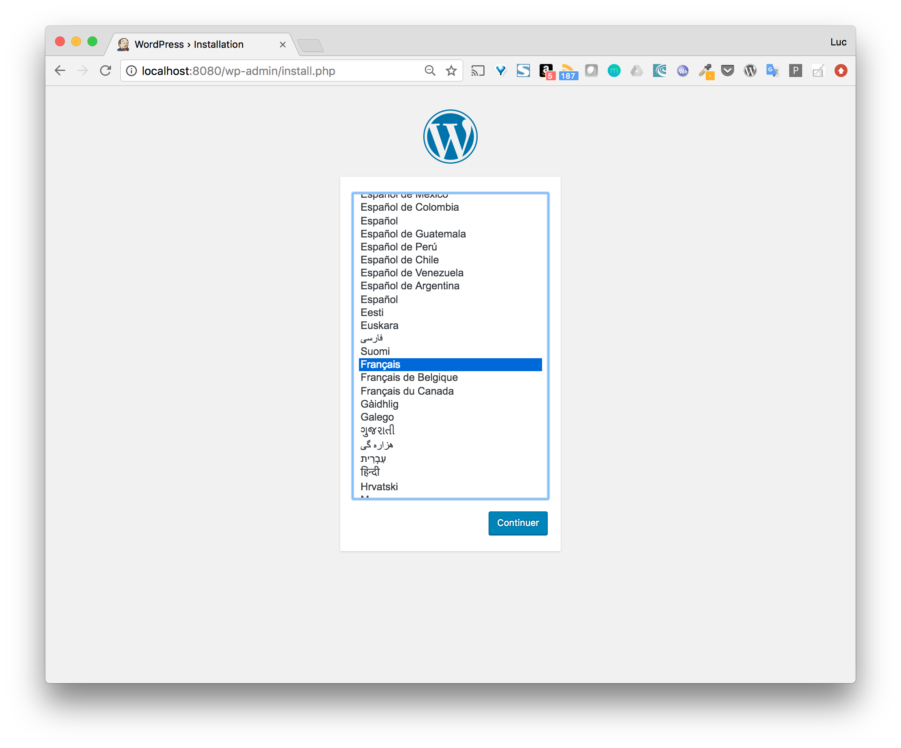
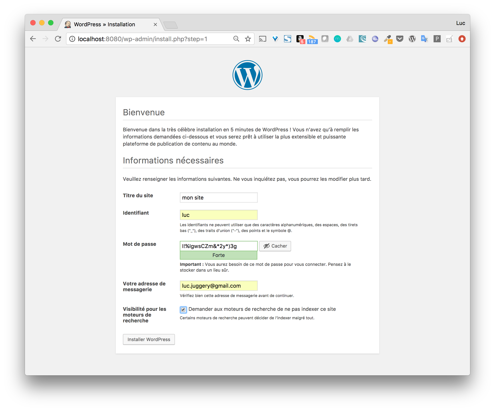
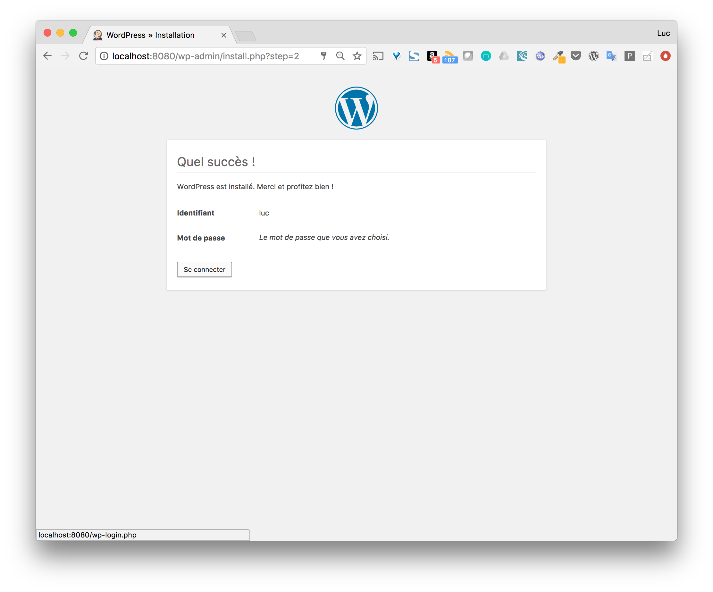
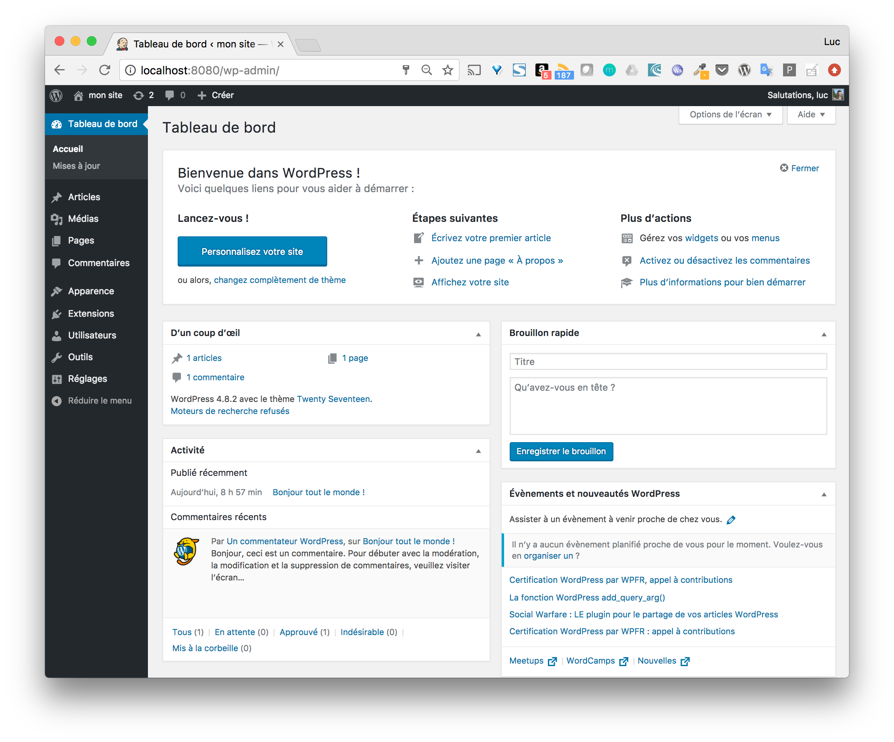

# Deploying a Wordpress site

In this part, we will use Docker Compose to deploy the wordpress engine and the mysql database it uses. 

## The docker-compose.yml file

Create a wp directory and inside it create the docker-compose file with the following content:

```
version: '3.3'

services:

  wordpress:
    image: wordpress:4.8
    restart: always
    ports:
      - 8080:80
    environment:
      WORDPRESS_DB_PASSWORD: example

  mysql:
    image: mysql:5.7
    restart: always
    environment:
      MYSQL_ROOT_PASSWORD: example
```

This file defines 2 services:
* the database based on the official mysql image in version 5.7
* The password to use is defined in an environment variable. 

the wordpress engine based on the official wordpress image in version 4.8
The password of the database is specified so that the wordpress engine can connect to it. In addition, the port on which the web interface will be available on the host machine is specified. 

Note: the password is given here in an environment variable, which may be acceptable in a development context. In a production context we will deploy the application on a Swarm and use secrets to pass confidential information. 

For each service, we use the restart: always statement so that the service container is restarted in case of an unexpected stop.

## Launching the application

Start the different services of the application with the following command:

```
$ docker-compose up -d
Creating network "wp_default" with the default driver
Pulling wordpress (wordpress:4.8)...
4.8: Pulling from library/wordpress
85b1f47fba49: Already exists
66e22dddbf92: Pull complete
bf0df491fd2e: Pull complete
425226034711: Pull complete
5ba5c1815115: Pull complete
98ab63dc099c: Pull complete
389f9436e431: Pull complete
d5bc131d410e: Pull complete
9cb5e45bde9b: Pull complete
1e02f171c87c: Pull complete
d83f7a2556ee: Pull complete
af433a413562: Pull complete
854be1a14f98: Pull complete
bc9f42bdc2d1: Pull complete
efd68ec31283: Pull complete
d16023bf10b9: Pull complete
3a8536890fbd: Pull complete
c513a7b57f27: Pull complete
Digest: sha256:cbbde8c4d10bf8c329d3382c3e77f87ea08add92ab9d1566b0030f4c5f3fb97b
Status: Downloaded newer image for wordpress:4.8
Pulling mysql (mysql:5.7)...
5.7: Pulling from library/mysql
85b1f47fba49: Already exists
27dc53f13a11: Already exists
095c8ae4182d: Already exists
0972f6b9a7de: Already exists
1b199048e1da: Pull complete
159de3cf101e: Pull complete
2ff639f4e6d9: Pull complete
8c8d7a93157e: Pull complete
ce5afe5b139c: Pull complete
b8c916ff94d5: Pull complete
e934932d4d25: Pull complete
Digest: sha256:eb9a3bca059ee178b5a69a2443462d156ff5b3d3f739c516b62d9d902ba49132
Status: Downloaded newer image for mysql:5.7
Creating wp_wordpress_1 ...
Creating wp_mysql_1 ...
Creating wp_mysql_1
Creating wp_wordpress_1 ... done
```

The 2 images are retrieved from the Docker Hub, and the application is launched in background.

## Site configuration

As we said before, the web interface is available on port 8080 of the host machine, this is due to the following instruction doing a port mapping.

```
    ports:
      - 8080:80
```

From the interface, we can configure our new wordpress site.







Once configured, we can connect with the account we created.




## Data persistence

The previous example is very simple and does not take into account data persistence. Using the following commands, we delete the application and create it again.

```
$ docker-compose down
$ docker-compose up -d
```

The creation will be much faster than before because the images are already present locally. But when we access the web interface, we will have to reconfigure a new application, as none of the elements we had previously configured have been saved.

In order to save these different elements, we create 2 volumes:
* db: used to save the site information (user accounts, configuration settings, ...)
* www: used to save web pages (theme, plugins, ...)

We then modify the docker-compose.yml file so that the wordpress and mysql services use these volumes.

```
version: '3.3'

services:

  wordpress:
    image: wordpress:4.8
    restart: always
    ports:
      - 8080:80
    environment:
      WORDPRESS_DB_PASSWORD: example
    volumes:
      - www:/var/www/html

  mysql:
    image: mysql:5.7
    restart: always
    environment:
      MYSQL_ROOT_PASSWORD: example
    volumes:
      - db:/var/lib/mysql

volumes:
  www:
  db:
```

We can then run our application again and we can see that the volumes wp_www and wp_db are created, they are prefixed by wp the name of the current directory.

```
$ docker-compose up -d
Creating network "wp_default" with the default driver
Creating volume "wp_www" with default driver
Creating volume "wp_db" with default driver
Creating wp_wordpress_1 ...
Creating wp_mysql_1 ...
Creating wp_wordpress_1
Creating wp_mysql_1 ... done
```

Once configured, the data will be persisted on the host machine and independent of the application's life cycle.

If you delete the application and restart it, the site will still be available, as all the data has been persisted in the volumes.

```
$ docker-compose down
$ docker-compose up -d
```

Note: it is possible to delete the volumes by using the -v option when deleting the application

```
$ docker-compose down -v
Stopping wp_mysql_1 ... done
Stopping wp_wordpress_1 ... done
Removing wp_mysql_1 ... done
Removing wp_wordpress_1 ... done
Removing network wp_default
Removing volume wp_www
Removing volume wp_db
```
