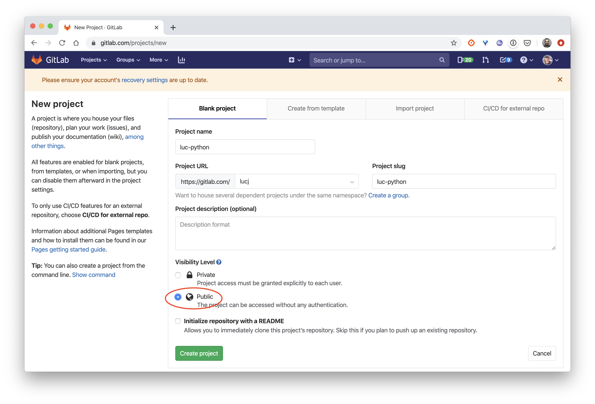
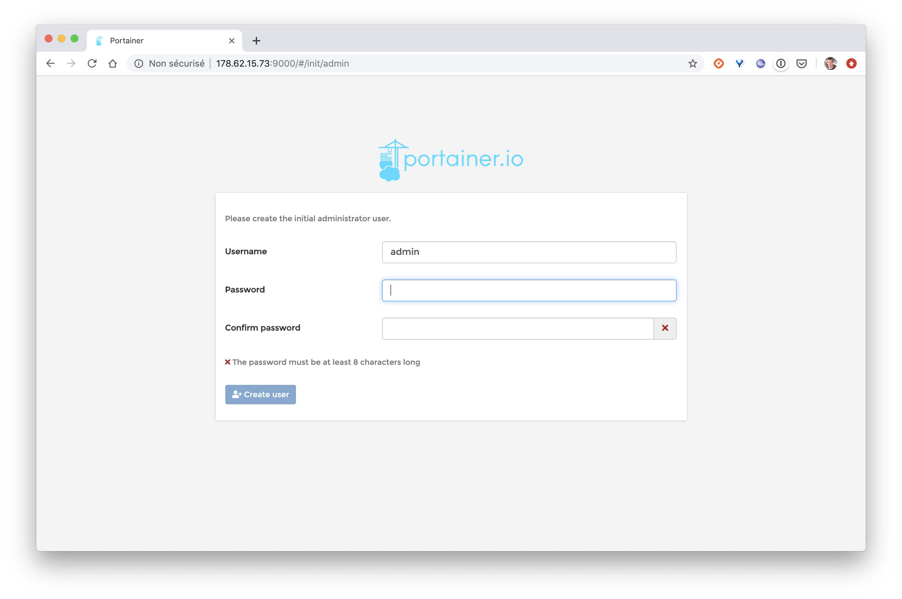
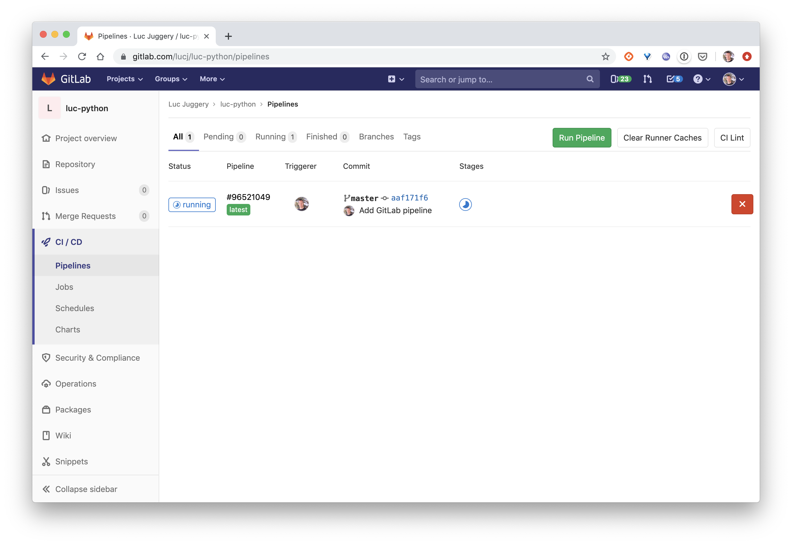
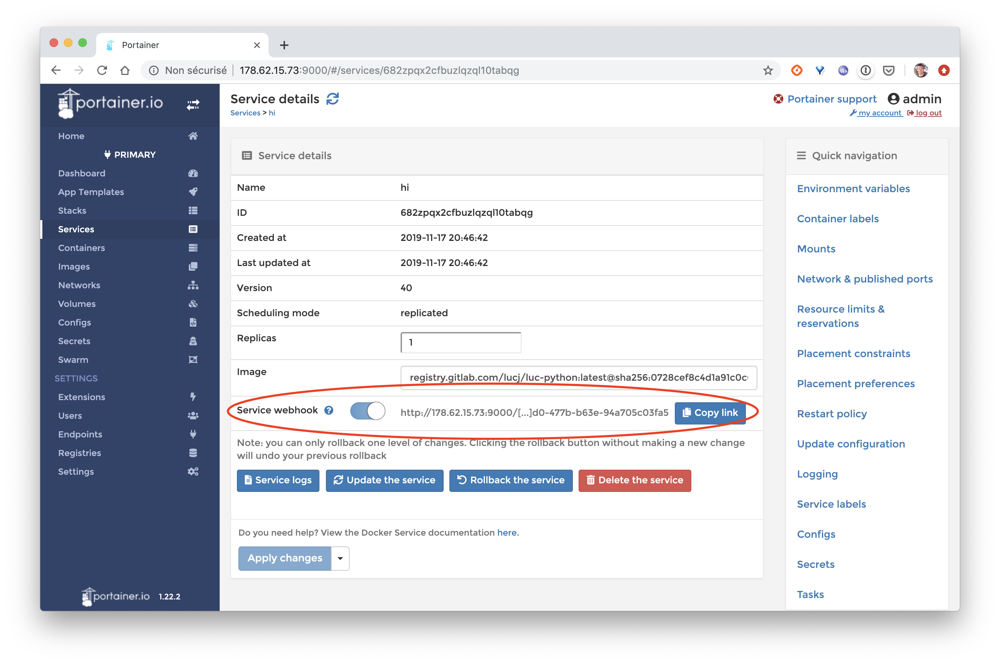

# The steps

You will follow the different steps below:

1. Creation, in the language of your choice, of a very simple web server

2. Add a Dockerfile and create an image of the application  

3. Create a repository on GitLab  

4. Setting up a Swarm cluster  

5. Setting up a continuous integration pipeline and continuous deployment

---

# Step 1: Create a web server

Using the language of your choice, develop a simple web server with the following characteristics:
- listens on port 8000
- exposes the endpoint */* in GET
- returns the string 'Hi!' for each request received.

Note: you can use one of the templates below, realized in different languages:

- NodeJs
- Python
- Ruby
- Go
- Java
- .net core

## NodeJs

### Installation

Follow the instructions to install NodeJS: [https://nodejs.org/](https://nodejs.org/)

### Code source

- index.js

```
var express = require('express');
var app = express();
app.get('/', function(req, res) {
    res.setHeader('Content-Type', 'text/plain');
    res.end("Hi!");
});
app.listen(8000);
```

- package.json

```
{
  "name": "www",
  "version": "0.0.1",
  "main": "index.js",
  "scripts": {
    "start": "node index.js"
  },
  "dependencies": {
    "express": "^4.14.0"
  }
}
```

### Installation de expressjs

```
$ npm install
```

### Lancement du serveur

```
$ npm start
```

### Test

```
$ curl localhost:8000
Hi!
```

---

## Python

### Installation

Python Installation: [https://www.python.org/downloads/](https://www.python.org/downloads/)

### Code source

- app.py

```
from flask import Flask
app = Flask(__name__)

@app.route("/")
def hello():
    return "Hi!"

if __name__ == "__main__":
    app.run(host='0.0.0.0', port=8000)
```

- requirements.txt

```
Flask==2.0.2
```

### Installation des dépendances

```
$ pip install -r requirements.txt
```

### Lancement du serveur

```
$ python app.py
```

### Test

```
$ curl localhost:8000
Hi!
```

---

## Ruby

### Installation

Ruby installation: [https://www.ruby-lang.org/fr/documentation/installation/](https://www.ruby-lang.org/fr/documentation/installation/)

### Code source

- app.rb

```
require 'sinatra'
set :port, 8000
get '/' do
  'Hi!'
end
```

- Gemfile

```
source :rubygems
gem "sinatra"
```

### Installation des dépendances

```
$ bundle install
```

### Lancement du serveur

```
$ ruby app.rb -s Puma
```

### Test

```
$ curl localhost:8000
Hi!
```

--

## Go

### Installation

GO Compiler installation: [https://golang.org/doc/install](https://golang.org/doc/install)

### Code source

- main.go

```
package main

import (
        "io"
        "net/http"
)

func handler(w http.ResponseWriter, req *http.Request) {
    io.WriteString(w, "Hi!")
}

func main() {
        http.HandleFunc("/", handler)
        http.ListenAndServe(":8000", nil)
}
```

### Lancement du serveur

```
$ go run main.go
```

### Test

```
$ curl localhost:8000
Hi!
```

---

## Java / Spring

### Installation

Follow these instructions to install the Java compiler: [https://java.com](https://java.com)

The test application is generated from [https://start.spring.io/](https://start.spring.io/) using the following options:


### Packaging de l'application

```
$ ./mvnw package
```

### Lancement du serveur

```
$ java -jar target/demo-0.1.jar
```

### Test

```
$ curl http://localhost:8080/
hello World
```

## DotNetCore

### Création du projet

Générez un quelette de projet DotNetCore avec la commande suivante:

```
$ dotnet new webapi -o webapi
```

### Compilation

```
$ cd webapi
$ dotnet restore
$ dotnet publish -c Release -o out
```

### Lancement du serveur

```
$ dotnet out/webapi.dll
```

### Test

```
$ curl https://localhost:5000/api/values
["value1","value2"]
```

In the next part, you will package the application in a Docker image.

---

# 2nd step : Creating a Docker image

## Add a Dockerfile

Add a Dockerfile to the root of the directory containing the web server source code. You will then use this Dockerfile to create an image containing the code of your application and all the dependencies that are needed to run it.

Below are examples of Dockerfiles for a web server written in different languages.

Important: first try to write your own version of the Dockerfile before using one of those below :)

### Dockerfile example for a web server written in Java

```
FROM openjdk:8-jdk
COPY . /
RUN ./mvnw --batch-mode package

FROM openjdk:8-jdk
COPY --from=0 target/*.jar app.jar
ENV SERVER_PORT=8000
ENTRYPOINT ["java","-Djava.security.egd=file:/dev/./urandom","-jar","/app.jar"]
EXPOSE 8000
```

### Dockerfile example for a web server written in Python

```
FROM python:3
COPY . /app
WORKDIR /app
RUN pip install -r requirements.txt
EXPOSE 8000
CMD python /app/app.py
```

### Dockerfile example for a web server written in Node.Js

```
FROM node:12-alpine
COPY . /app
WORKDIR /app
RUN npm i
EXPOSE 8000
CMD ["npm", "start"]
```

### Dockerfile example for a web server written in Go

```
FROM golang:1.12-alpine as build
WORKDIR /app
COPY main.go .
RUN CGO_ENABLED=0 GOOS=linux go build -a -installsuffix cgo -o main .

FROM scratch
COPY --from=build /app/main .
CMD ["./main"]
```

## Image build

Once you have created your Dockerfile, build an image, named *api* using the following command:

```
$ docker build -t api .
```

## Lancement d'un container

Now check that the application runs correctly when launched in a container (by publishing the port 8000):

```
$ docker run -ti -p 8000:8000 api
```

Then check that the web server is accessible on port *8000* from the local machine.
```
$ curl http://localhost:8000
```

---

# 3rd step: GitLab repository

## 1. gitlab.com

Create an account from https://gitlab.com, or use your own account if you already have one.


Important: make sure you copy your public ssh key into your GitLab account configuration. In the following, this will allow you to upload the code from your server without having to enter your login and password each time.

## 2. Creating a project

Once you are connected on https://gitlab.com, create a new project by giving it the name you want.

> Make sure you select *Public* in the *Visibility Level* section.



## 3. Send the application code

Follow the instructions detailed in the section *Push an existing folder* in order to send the code of your application in the project you just created.

In the next step, you will set up a Docker Swarm cluster in which you will deploy your server.

---

# 4th step: Cluster Swarm

## Creating a Docker host

In this part you will need a virtual machine accessible from the Internet. For a few euros you can for example create one on a cloud provider such as DigitalOcean, OVH, Scaleway, Google Compute Plateform, Amazon AWS, ...

Once the VM is set up, connect to it with ssh and install Docker with the following command:

```
$ curl https://get.docker.com | sh
```

## Initialization of a Swarm cluster

Then initialize a Docker Swarm with the following command:

```
$ docker swarm init
```

> Note: if you get an error similar to: "Error response from daemon: could not choose an IP address to advertise since this system has multiple addresses on interface eth0 (178.62.15.73 and 10.16.0.7) - specify one with --advertise-addr", re-run the Initialization command with the external IP address of the VM

## Installing Portainer

Still from the previous shell, install the Portainer tool as a Docker Stack on the Swarm. Portainer will allow you to manage your Swarm with a very intuitive web interface.

```
$ curl -L https://downloads.portainer.io/portainer-agent-stack.yml -o portainer-agent-stack.yml
$ docker stack deploy --compose-file=portainer-agent-stack.yml portainer
```

Then check that Portainer is available by launching a browser on the following address

http://VM_IP_ADDRESS:9000 !



Follow the instructions and set a password for the user *admin*. You will then have access to the Portainer dashboard.

Portainer](./images/portainer-2.png)

Click on the cluster that is presented, you will then see all the elements that are running in the Swarm (only Portainer is present for the moment)

Portainer](./images/portainer-3.png)

In the next step, you will set up a CICD pipeline

---

# 5th (and last) step: CICD

## Using GitLab CI

At the root of the directory containing your project's sources, create a `.gitlab-ci.yml` file containing the following instructions:

```
stages:
  - package

push image docker:
  image: docker:stable
  stage: package
  services:
    - docker:18-dind
  script:
    - docker build -t $CI_REGISTRY_IMAGE .
    - docker login -u gitlab-ci-token -p $CI_BUILD_TOKEN $CI_REGISTRY
    - docker push $CI_REGISTRY_IMAGE
```

This file defines a step named *package* containing a set of instructions to build an image of the application and to push it to the registry available in GitLab.

Commit your code and send it to the GitLab repository:

```
git add .gitlab-ci.yml
$ git commit -m 'Add GitLab pipeline
$ git push origin master
```

Then go to the GitLab interface and check, in the *CI / CD* menu, that a first pipeline is running.



Once this one is finished, go to the *Packages -> Container Registry* menu and check that the first image of your application has been built and that it is available in the registry.


## Adding an integration test

In the `.gitlab-ci.yml` file, add an *integration* entry under the *stage* key.

```
stages:
  - package
  - integration
```

At the end of the file, also add a new stage *integration test*:

```
integration test:
  image: docker:stable
  stage: integration
  services:
    - docker:18-dind
  script:
    - docker run -d --name myapp $CI_REGISTRY_IMAGE
    - sleep 10s
    - TEST_RESULT=$(docker run --link myapp lucj/curl -s http://myapp:8000)
    - echo $TEST_RESULT
    - $([ "$TEST_RESULT" == "Hello World!" ])
```

This step defines a test that will be performed on the image created in the previous step. This very simple test makes sure that the returned string is "Hello World!

Commit the code again and upload it to the GitLab repository.

```
$ git add .gitlab-ci.yml
$ git commit -m 'Add integration step
$ git push origin master
```

From the GitLab interface, verify that a new pipeline has been triggered. After a few dozen seconds, you should see that the *integration* step has failed.

GitLab failed job](./images/gitlab_failed_job.png)

Check the content of the integration step logs, this will allow you to correct the code. You can then commit this change and send it to GitLab. Make sure that the new triggered pipeline runs without errors this time.

## Creating a service

You will now deploy your application as a Docker Service. Use the following command replacing:
- GITLAB_USER with your GitLab ID
- GITLAB_REPO with the name of your GitLab project

```
$ docker service create
  --name hi \
  --publish 8080:8000
  registry.gitlab.com/GITLAB_USER/GITLAB_REPO:latest
```

Note: the service port 8000 is published on port 8080 on the Swarm cluster node because port 8000 is already used by Portainer.

## Portainer Webhook

From the Portainer interface, make sure the Service is active:


From the Service details page, enable the radio button *Service webhook*. This will generate a URL to which an HTTP POST request can be sent to update the Service.



Copy this URL and use this value for the *PORTAINER_WEBHOOK* variable that you can create from the *Settings > CI / CD* menu.

Portainer](./images/portainer-webhook-variable.png)

## Automatic deployment

The next step is to add a deployment phase, named *deploy* in the *.gitlab-ci.yml* file. Add this new entry to the *stages* list:

```
stages:
  - package
  - integration
  - deploy
```

At the end of the file, also add the *deploy-swarm* step that will be executed in the context of this *deploy* phase:

```
deploy-swarm:
  stage: deploy
  image: alpine:3.9
  script:
    - apk add --update curl
    - curl -XPOST $PORTAINER_WEBHOOK
```

The only action in this step is to call the webhook defined by Portainer by sending a POST request to the URL associated with the service.

Then make a change in the code of your application, for example change the returned string (make sure you change the test description at the same time). Commit these changes and send the code to GitLab.

Finally, check that the new version of your application has been correctly deployed.