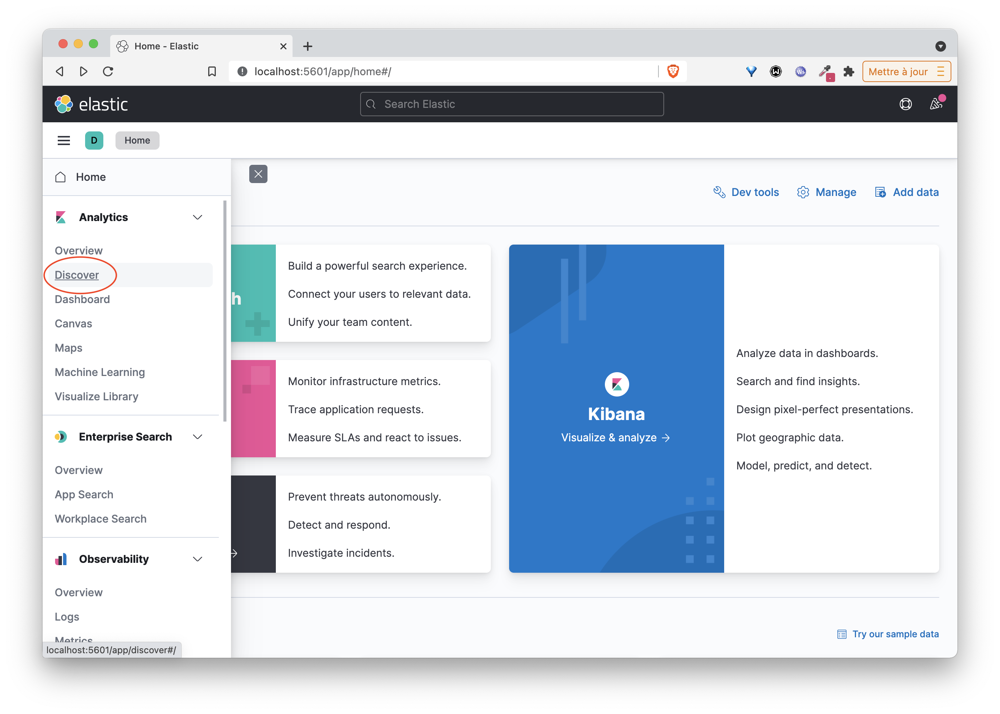
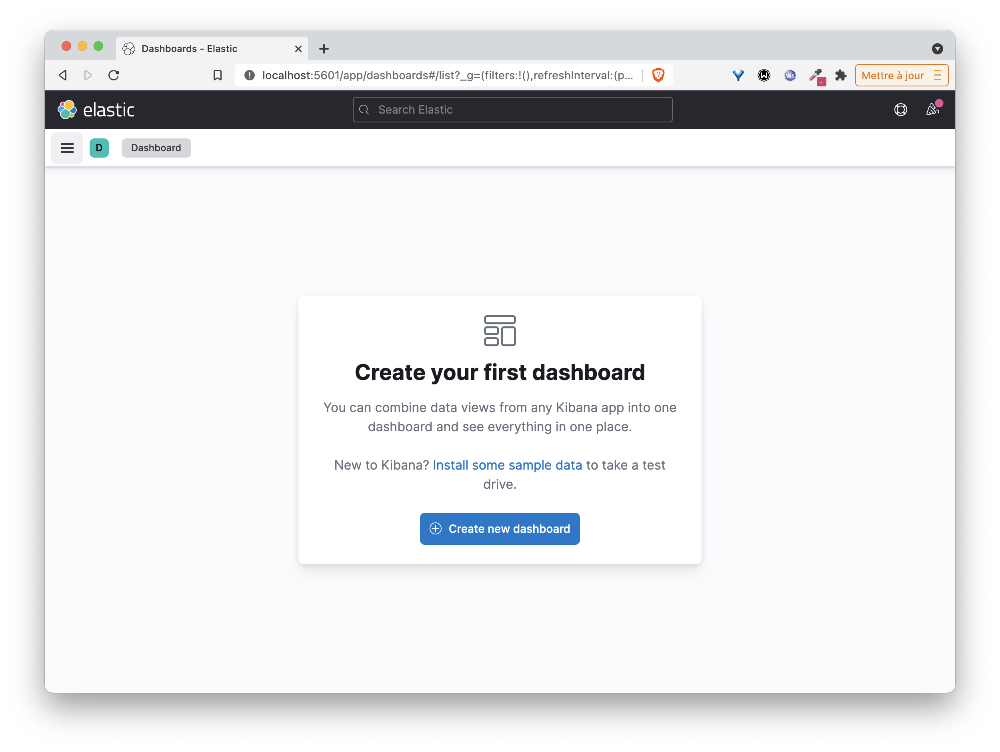

# La stack ELK (Elastic)

Cette stack est très souvent utilisée notamment pour ingérer et indexer des logs. Elle est composée de 3 logiciels:
* Logstash qui permet de filtrer / formatter les données entrantes et de les envoyer à Elasticsearch (et à d'autres applications)
* Elasticsearch, le moteur responsable de l'indexation des données
* Kibana, l'application web permettant la visualisation des données

## Le but de cet exemple

Dans cet exemple, nous allons utiliser Docker Compose pour lancer une stack ELK en configurant Logstash de façon à :
- ce qu'il puisse recevoir des entrées de log sur un endpoint HTTP
- extraire le champs présent dans chaque entrée et ajouter des informations de reverse geocoding
- envoyer chaque ligne dans Elasticsearch

L'interface de Kibana nous permettra de visualiser les logs et de créer des dashboards.

Note: nous considérerons que les fichiers de log sont générés par un serveur web comme apache / nginx, cela nous sera utile pour spécifier la façon dont Logstash doit réaliser le parsing.

## Définition de l'application dans un fichier au format Compose

Afin de définir notre stack ELK, créez un répertoire *elk* et, à l'intérieur de celui-ci, le fichier *docker-compose.yml* avec le contenu suivant:

```
services:
  logstash:
    image: logstash:7.14.2
    environment:
      discovery.seed_hosts: logstash
      LS_JAVA_OPTS: "-Xms512m -Xmx512m"
    volumes:
      - ./logstash.conf:/config/logstash.conf
    command: ["logstash", "-f", "/config/logstash.conf"]
    ports:
      - 8080:8080
  elasticsearch:
    image: elasticsearch:7.14.2
    environment:
      discovery.type: single-node
      ES_JAVA_OPTS: "-Xms512m -Xmx512m"
  kibana:
    image: kibana:7.14.2
    ports:
      - 5601:5601
```

Notes:
- Le service Logstash est basé sur l'image officielle logstash:7.14.2.
Nous précisons, sous la clé volumes, que le fichier de configuration logstash.conf présent dans le répertoire est monté sur /config/logstash.conf dans le container. Il sera pris en compte par Logstash au démarrage
- Le service Kibana est basé sur l'image officielle kibana:7.14.2. Le mapping de port permettra à l'interface web d'être disponible sur le port 5601 de la machine hôte.

## Fichier de configuration de Logstash

Nous allons tout dabord définir un fichier de configuration pour Logstash. Dans le répertoire *elk* (ou se trouve le fichier docker-compose.yml), créez le fichier *logstash.conf* avec le contenu suivant

```
input {
 http {}
}

filter {
 grok {
   match => [ "message" , "%{COMBINEDAPACHELOG}+%{GREEDYDATA:extra_fields}"]
   overwrite => [ "message" ]
 }
 mutate {
   convert => ["response", "integer"]
   convert => ["bytes", "integer"]
   convert => ["responsetime", "float"]
 }
 geoip {
   source => "clientip"
   target => "geoip"
   add_tag => [ "nginx-geoip" ]
 }
 date {
   match => [ "timestamp" , "dd/MMM/YYYY:HH:mm:ss Z" ]
   remove_field => [ "timestamp" ]
 }
 useragent {
   source => "agent"
 }
}

output {
 elasticsearch {
   hosts => ["elasticsearch:9200"]
 }
 stdout { codec => rubydebug }
}
```

Ce fichier peu sembler un peu compliqué. Il peut être découpé en 3 parties:
* input: permet de spécifier les données d'entrée. Nous spécifions ici que Logstash peut recevoir des données (entrées de logs)  sur du http

* filter: permet de spécifier comment les données d'entrée doivent être traitées avant de passer à l'étape suivante. Plusieurs instructions sont utilisées ici:
  * grok permet de spécifier comment chaque entrée doit être parsée. De nombreux parseurs sont disponibles par défaut et nous spécifions ici (avec COMBINEDAPACHELOG) que chaque ligne doit être parsée suivant un format de log apache, cela permettra une extraction automatique des champs comme l'heure de création, l'url de la requête, l'ip d'origine, le code retour, ...
  * mutate permet de convertir les types de certains champs
  * geoip permet d'obtenir des informations géographique à partir de l'adresse IP d'origine
  * date est utilisée ici pour reformatter le timestamp

* output: permet de spécifier la destination d'envoi des données une fois que celles-ci sont passées par l'étape filter

## Lancement de la stack ELK

Vous pouvez ensuite lancer la stack avec la commande suivante

```
docker-compose up -d
```

Une fois les images récupérées sur le Docker Hub, le lancement de l'application peut prendre quelques dizaines de secondes.

Vérifiez ensuite que les 3 services ont été lancés:

```
docker-compose ps
```

L'interface web de Kibana est alors accessible sur le port 5601 de la machine hôte (nous y reviendrons par la suite)

## Utilisation d'un fichier de logs de test

Nous allons tout d'abord utiliser un fichier de log de test et envoyer son contenu dans Logstash, contenu qui sera filtré et envoyé à Elasticsearch.

Nous utilisons pour cela l'image *mingrammer/flog* afin de générer des entrées de log au format Nginx. Le fichier nginx.log généré contient 1000 entrées de logs.

```
docker run mingrammer/flog -f apache_combined > nginx.log
```

La commande suivante permet d'envoyer chaque ligne à Logstash:

:fire: assurez-vous d'avoir remplacé HOST par l'adresse IP de la machine sur laquelle la stack Elastic a été lancée

```
while read -r line; do curl -s -XPUT -d "$line" http://HOST:8080; done < ./nginx.log
```

:fire: vous devriez voir une succession de *ok* s'afficher, cela permet simplement de s'assurer que l'envoi des entrées de log s'est déroulée correctement

Une fois le script terminé, ouvrez un onglet sur l'interface de Kibana http://HOST_IP:5601 (en remplaçant HOST_IP par l'adresse IP de la machine sur laquelle le stack Elastic a été lancée)

Cliquez sur le lien *Explore on my own* puis ensuite sur *Discover* dans la categorie *Analytics* du menu de gauche 




Suivez ensuite les instructions pour créer un *Index Pattern* qui permettra d'indexer les logs que vous enverez par la suite.


Kibana permet de faire des dashboards de visualisation et exploiter ainsi les informations contenues dans les logs. Les copies d'écran suivantes détaillent les étapes pour la création d'une première visualisation.





Manipulez ensuite l'interface pour créer vos propres visualisations et un dashboard pour grouper celles-ci.

## Cleanup

Vous pouvez ensuite supprimer cette stack à l'aide de la commande suivante:

```
docker compose down -v
```
