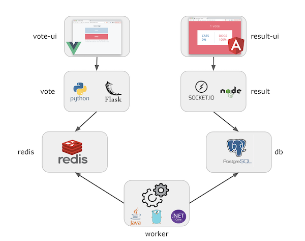
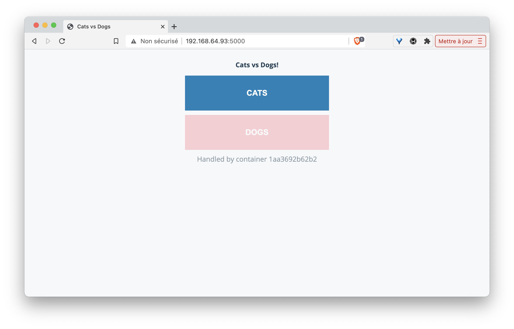
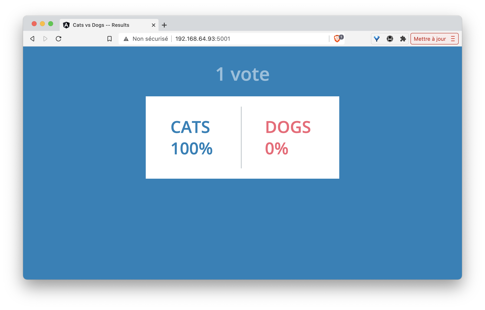

# Voting application

Dans cet exercice, nous allons illustrer l’utilisation de *Docker Compose* et lancer l’application *Voting App*. Cette application est très utilisée pour des présentations et démos, c'est un bon exemple d'application micro-services simple.

## Vue d’ensemble

L’application *Voting App* est composée de plusieurs micro-services, ceux utilisés pour la version 2 sont les suivants:



* vote-ui: front-end permettant à un utilisateur de voter entre 2 options
* vote: back-end réceptionnant les votes
* result-ui: front-end permettant de visualiser les résultats
* result: back-end mettant à disposition les résultats
* redis: database redis dans laquelle sont stockés les votes
* worker: service qui récupère les votes depuis redis et consolide les résultats dans une database postgres
* db: database postgres dans laquelle sont stockés les résultats

##  Récupération des repos GitLab

Lancez les commandes suivantes afin de récupérer le répo de chaque microservice ainsi que celui de configuration:

```
mkdir VotingApp && cd VotingApp
for project in config vote vote-ui result result-ui worker; do
  git clone https://gitlab.com/voting-application/$project
done
```

## Le format de fichier compose.yaml

Plusieurs fichiers, au format Docker Compose, sont disponibles dans *config/compose*:

- *compose.dev.yaml* est utilisé pour lancer l'application pour un contexte de développement
- *compose.yaml* est utilisé pour builder les images de chaque microservice pour un context de production

## Lancement de l’application

Depuis le répertoire *config/compose*, lancez l’application à l'aide de la commande suivante (le fichier *compose.yaml* sera utilisé par défaut):

```
docker compose up -d
```

Les étapes réalisées lors du lancement de l’application sont les suivantes:
* création des networks front-tier et back-tier
* création du volume db-data
* construction des images pour les services *vote-ui*, *vote*, *result-ui*, *result*, *worker* et récupération des images *redis* et *postgres*
* lancement des containers pour chaque service

Note: un reserve proxy basé sur Traefik sera également lancé mais il ne sera pas utilisé dans cet exercice.

## Les containers lancés

Avec la commande suivante, listez les containers qui ont été lancés et assurez-vous qu'ils sont tous dans le status *Up*:

```
docker compose ps
```

## Les volumes créés

Listez les volumes avec la CLI, et vérifiez que le volume défini dans le fichier *docker-compose.yml* est présent.

```
docker volume ls
```

Le nom du volume est prefixé par le nom du répertoire dans lequel l’application a été lancée.

```
DRIVER    VOLUME NAME
local     compose_db-data
...
```

Par défaut ce volume correspond à un répertoire créé sur la machine hôte.

## Les networks créés

Listez les networks avec la CLI. Les deux networks définis dans le fichier *docker-compose.yml* sont présents.

```
docker network ls
```

De même que pour le volume, leur nom est préfixé par le nom du répertoire.

```
NETWORK ID     NAME                 DRIVER    SCOPE
71d0f64882d5   bridge               bridge    local
409bc6998857   compose_back-tier    bridge    local
b3858656638b   compose_front-tier   bridge    local
2f00536eb085   host                 host      local
54dee0283ab4   none                 null      local
```

Note: comme nous sommes dans le contexte d’un hôte unique le driver utilisé pour la création de ces networks est du type bridge. Il permet la communication entre les containers tournant sur une même machine.

## Utilisation de l’application

Nous pouvons maintenant accéder à l’application:

nous effectuons un choix entre les 2 options depuis l'interface de vote à l'adresse http://HOST_IP:5000 



nous visualisons le résultat depuis l'interface de résultats à l'adresse http://HOST_IP:5001



Note: remplacez HOST_IP par localhost ou bien par l'adresse IP de la machine sur laquelle a été lancée l'application

## Scaling du service worker

Par défaut, un container est lancé pour chaque service. Il est possible, avec l'option *--scale*, de changer ce comportement et de scaler un service une fois qu’il est lancé.

Avec la commande suivante, augmenter le nombre de worker à 2.

```
docker compose up -d --scale worker=2
```

Vérifiez qu'il y a à présent 2 containers pour le service worker:

```
docker compose ps
```

Notes: il n’est pas possible de scaler les services *vote-ui* et *result-ui* car ils spécifient tous les 2 un port, plusieurs containers ne peuvent pas utiliser le même port de la machine hôte

## Suppression de l’application

Avec la commande suivante, stoppez l’application. Cette commande supprime l’ensemble des éléments créés précédemment à l'exception des volumes (afin de ne pas perdre de données)

```
docker compose down
```

Afin de supprimer également les volumes utilisés, il faut ajouter le flag *-v*:

```
docker compose down -v
```