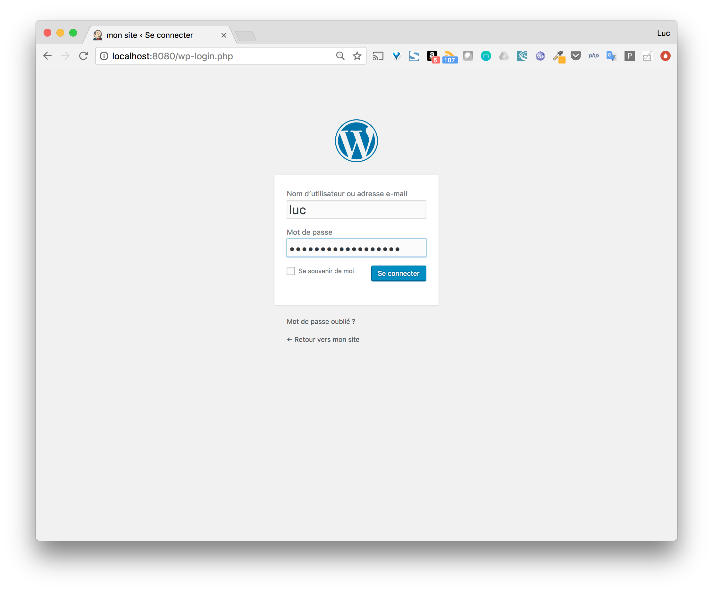

# Déploiement d'un site Wordpress

Dans cette partie, nous allons utiliser Docker Compose afin de déployer le moteur wordpress et la database mysql que celui-ci utilise. 

## Le fichier docker-compose.yml

Créez un répertoire wp et à l'intérieur de celui-ci créez le fichier docker-compose avec le contenu suivant:

```
version: '3.3'

services:

  wordpress:
    image: wordpress:4.8
    restart: always
    ports:
      - 8080:80
    environment:
      WORDPRESS_DB_PASSWORD: example

  mysql:
    image: mysql:5.7
    restart: always
    environment:
      MYSQL_ROOT_PASSWORD: example
```

Ce fichier défini 2 services:
* la base de données basée sur l'image officielle mysql dans la version 5.7
* Le mot de passe à utiliser est défini dans une variable d'environnement. 

le moteur wordpress basé sur l'image officielle wordpress dans la version 4.8
Le mot de passe de la base de donnée est spécifié de façon à ce que le moteur wordpress puisse s'y connecter. De plus, on spécifie le port sur lequel l'interface web sera disponible sur la machine hôte. 

Note: le mot de passe est ici donné dans une variable d'environnement, ce qui peut être acceptable dans un contexte de développement. Dans un contexte de production nous déploierons l'application sur un Swarm et nous utiliserons des secrets pour passer les informations confidentielles. 

Pour chaque service, nous utilisons l'instruction restart: always de façon à ce que le container du service soit redémarré en cas d'arrêt non prévu.

## Lancement de l'application

Lancez les différents services de l'application avec la commande suivante:

```
$ docker-compose up -d
Creating network "wp_default" with the default driver
Pulling wordpress (wordpress:4.8)...
4.8: Pulling from library/wordpress
85b1f47fba49: Already exists
66e22dddbf92: Pull complete
bf0df491fd2e: Pull complete
425226034711: Pull complete
5ba5c1815115: Pull complete
98ab63dc099c: Pull complete
389f9436e431: Pull complete
d5bc131d410e: Pull complete
9cb5e45bde9b: Pull complete
1e02f171c87c: Pull complete
d83f7a2556ee: Pull complete
af433a413562: Pull complete
854be1a14f98: Pull complete
bc9f42bdc2d1: Pull complete
efd68ec31283: Pull complete
d16023bf10b9: Pull complete
3a8536890fbd: Pull complete
c513a7b57f27: Pull complete
Digest: sha256:cbbde8c4d10bf8c329d3382c3e77f87ea08add92ab9d1566b0030f4c5f3fb97b
Status: Downloaded newer image for wordpress:4.8
Pulling mysql (mysql:5.7)...
5.7: Pulling from library/mysql
85b1f47fba49: Already exists
27dc53f13a11: Already exists
095c8ae4182d: Already exists
0972f6b9a7de: Already exists
1b199048e1da: Pull complete
159de3cf101e: Pull complete
2ff639f4e6d9: Pull complete
8c8d7a93157e: Pull complete
ce5afe5b139c: Pull complete
b8c916ff94d5: Pull complete
e934932d4d25: Pull complete
Digest: sha256:eb9a3bca059ee178b5a69a2443462d156ff5b3d3f739c516b62d9d902ba49132
Status: Downloaded newer image for mysql:5.7
Creating wp_wordpress_1 ...
Creating wp_mysql_1 ...
Creating wp_mysql_1
Creating wp_wordpress_1 ... done
```


Les 2 images sont récupérées depuis le Docker Hub, et l'application est lancée en background.

## Configuration du site

Comme nous l'avons dit précédemment, l'interface web est disponible sur le port 8080 de la machine hôte, ceci est du à l'instruction suivante effectuant un mapping de ports.

```
    ports:
      - 8080:80
```

Depuis l'interface, on peut donc configurer notre nouveau site wordpress.


Une fois configuré, nous pouvons nous connecter avec le compte que l'on a créé.




## Persistance des données

L'exemple précédent est très simple et ne prend pas en compte la persistance des données. A l'aide des commandes suivantes, on supprime l'application puis on la créé de nouveau.

```
$ docker-compose down
$ docker-compose up -d
```

La création sera beaucoup plus rapide que précédemment car les images sont déjà présentes localement. Mais lorsque l'on accède à l'interface web, il nous faudra reconfigurer une nouvelle application, aucun des éléments que nous avions configurés précédemment n'ayant été sauvegardés.

Afin de sauvegarder ces différents éléments, nous créons 2 volumes:
* db: utilisé pour la sauvegarde des informations du site (comptes des utilisateurs, paramètres de configuration, ...)
* www: utilisé pour la sauvegarde des pages web (thème, plugins, ...)

Nous modifions ensuite le fichier docker-compose.yml afin que les services wordpress et mysql utilisent ces volumes.

```
version: '3.3'

services:

  wordpress:
    image: wordpress:4.8
    restart: always
    ports:
      - 8080:80
    environment:
      WORDPRESS_DB_PASSWORD: example
    volumes:
      - www:/var/www/html

  mysql:
    image: mysql:5.7
    restart: always
    environment:
      MYSQL_ROOT_PASSWORD: example
    volumes:
      - db:/var/lib/mysql

volumes:
  www:
  db:
```

Nous pouvons alors lancer une nouvelle fois notre application et nous pouvons voir que les volumes wp_www et wp_db sont créés, ils sont préfixés par wp le nom du répertoire courant.

```
$ docker-compose up -d
Creating network "wp_default" with the default driver
Creating volume "wp_www" with default driver
Creating volume "wp_db" with default driver
Creating wp_wordpress_1 ...
Creating wp_mysql_1 ...
Creating wp_wordpress_1
Creating wp_mysql_1 ... done
```

Après l'avoir configuré, les données seront persistées sur la machine hôte et indépendantes du cycle de vie de l'application.

Si l'on supprime l'application et que l'on la relance, le site sera toujours disponible, l'ensemble des données ayant été persistées dans les volumes.

```
$ docker-compose down
$ docker-compose up -d
```

Note: il est possible de supprimer les volumes en utilisant l'option -v lors que l'on supprime l'application

```
$ docker-compose down -v
Stopping wp_mysql_1     ... done
Stopping wp_wordpress_1 ... done
Removing wp_mysql_1     ... done
Removing wp_wordpress_1 ... done
Removing network wp_default
Removing volume wp_www
Removing volume wp_db
```
