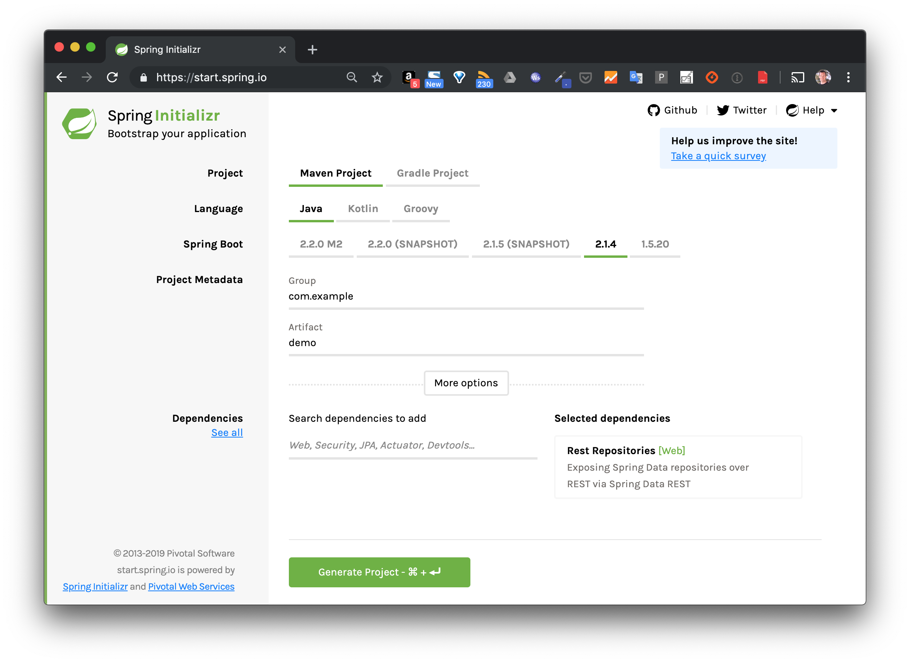
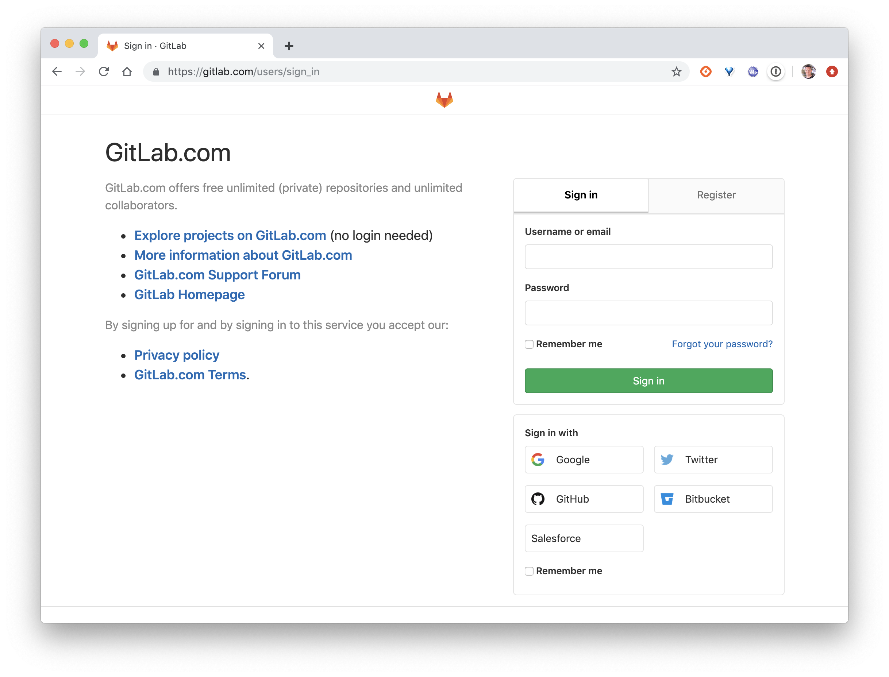
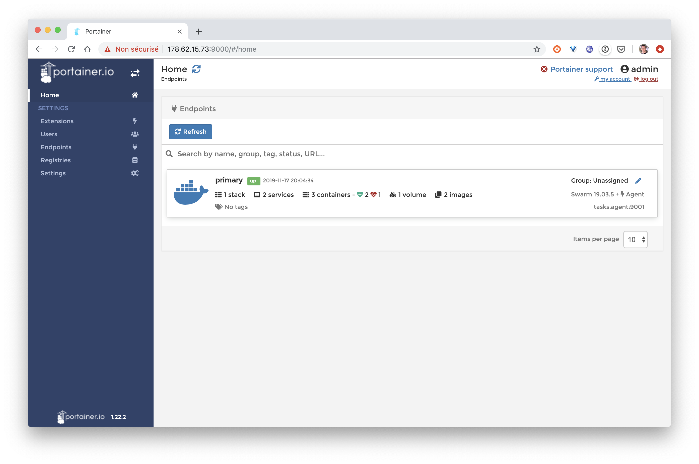
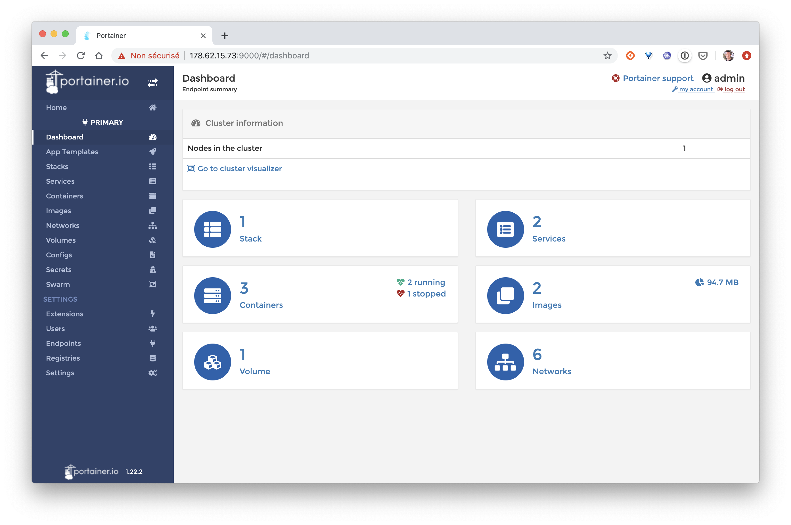
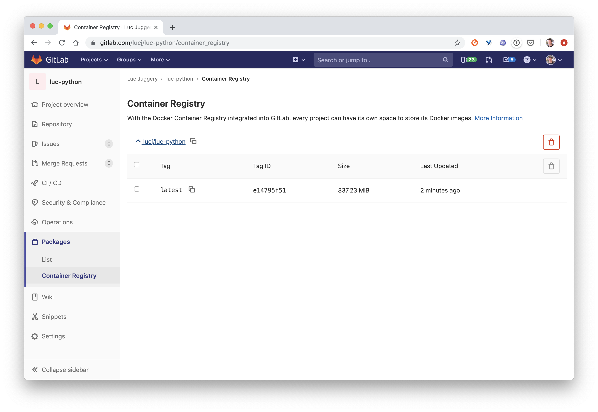
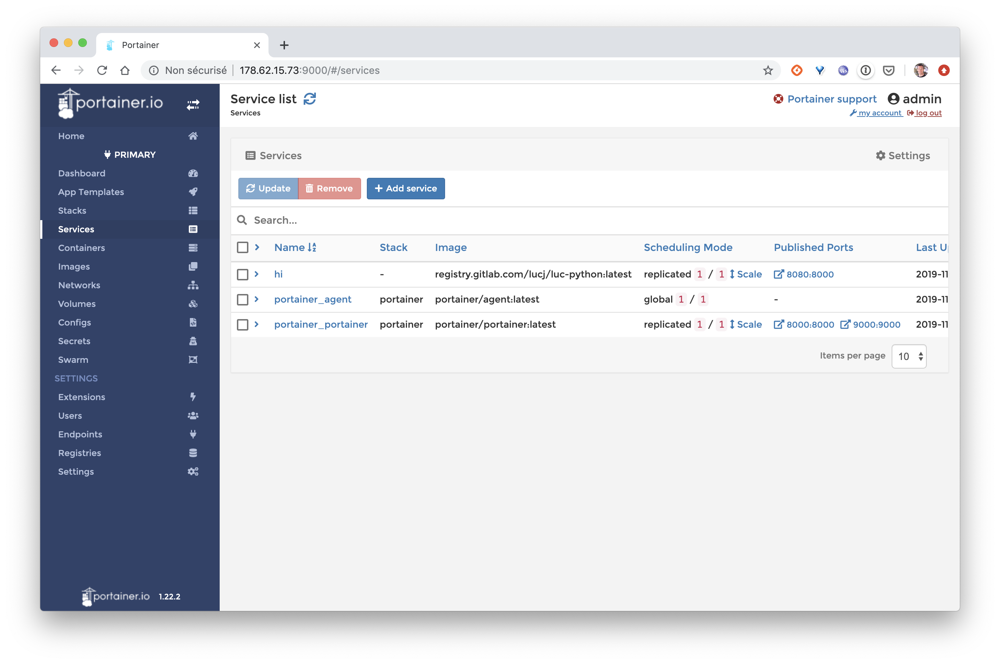

Dans cette activité, vous allez mettre en place un pipeline d'intégration continue / déploiement continu en utilisant différents composants: Docker Swarm, GitLab, Portainer

> Attention:
Pour faire cet exercice dans sa totalité, il sera nécessaire de créer une VM accessible depuis internet (étape 4). Pour l'ensemble des cloud providers (Google Compute Engine, Amazon AWS, Packet, Rackspace, DigitalOcean, Scaleway, ...) l'instantiation de VMs est payante (peu cher pour un test de quelques heures cependant). Si vous ne souhaitez pas réaliser la manipulation jiusqu'au bout, n'hésitez pas à suivre cet exercice sans l'appliquer, l'essentiel étant de comprendre le flow global.

---

# Les étapes

Vous allez suivre les différentes étapes ci-dessous:

1. Création, dans le langage de votre choix, d'un serveur web très simple

2. Ajouter un Dockerfile et création d'une image de l'application  

3. Création d'un répository sur GitLab  

4. Mise en place d'un cluster Swarm  

5. Mise en place d'un pipeline d'intégration continue et déploiement continu  

---

# 1ère étape: Création d'un serveur web

En utilisant le langage de votre choix, développez un serveur web simple ayant les caractéristiques suivantes:
- écoute sur le port 8000
- expose le endpoint */* en GET
- retourne la chaine 'Hi!' pour chaque requète reçue.

Note: vous pouvez utiliser l'un des templates ci-dessous, réalisé dans différents langages:

- NodeJs
- Python
- Ruby
- Go
- Java
- .net core

## NodeJs

### Installation

Suivez les instructions suivantes pour installer l'interpréteur NodeJS: [https://nodejs.org/](https://nodejs.org/)

### Code source

- index.js

```
var express = require('express');
var app = express();
app.get('/', function(req, res) {
    res.setHeader('Content-Type', 'text/plain');
    res.end("Hi!");
});
app.listen(8000);
```

- package.json

```
{
  "name": "www",
  "version": "0.0.1",
  "main": "index.js",
  "scripts": {
    "start": "node index.js"
  },
  "dependencies": {
    "express": "^4.14.0"
  }
}
```

### Installation de expressjs

```
$ npm install
```

### Lancement du serveur

```
$ npm start
```

### Test

```
$ curl localhost:8000
Hi!
```

---

## Python

### Installation

Suivez les instructions suivantes pour installer l'interpréteur Python: [https://www.python.org/downloads/](https://www.python.org/downloads/)

### Code source

- app.py

```
from flask import Flask
app = Flask(__name__)

@app.route("/")
def hello():
    return "Hi!"

if __name__ == "__main__":
    app.run(host='0.0.0.0', port=8000)
```

- requirements.txt

```
Flask==2.0.2
```

### Installation des dépendances

```
$ pip install -r requirements.txt
```

### Lancement du serveur

```
$ python app.py
```

### Test

```
$ curl localhost:8000
Hi!
```

---

## Ruby

### Installation

Suivez les instructions suivantes pour installer l'interpréteur Ruby: [https://www.ruby-lang.org/fr/documentation/installation/](https://www.ruby-lang.org/fr/documentation/installation/)

### Code source

- app.rb

```
require 'sinatra'
set :port, 8000
get '/' do
  'Hi!'
end
```

- Gemfile

```
source :rubygems
gem "sinatra"
```

### Installation des dépendances

```
$ bundle install
```

### Lancement du serveur

```
$ ruby app.rb -s Puma
```

### Test

```
$ curl localhost:8000
Hi!
```

--

## Go

### Installation

Suivez les instructions suivantes pour installer le compilateur GO: [https://golang.org/doc/install](https://golang.org/doc/install)

### Code source

- main.go

```
package main

import (
        "io"
        "net/http"
)

func handler(w http.ResponseWriter, req *http.Request) {
    io.WriteString(w, "Hi!")
}

func main() {
        http.HandleFunc("/", handler)
        http.ListenAndServe(":8000", nil)
}
```

### Lancement du serveur

```
$ go run main.go
```

### Test

```
$ curl localhost:8000
Hi!
```

---

## Java / Spring

### Installation

Suivez les instructions suivantes pour installer le compilateur Java: [https://java.com](https://java.com)

L'application de test est générée depuis [https://start.spring.io/](https://start.spring.io/) en utilisant les options suivantes:



### Packaging de l'application

```
$ ./mvnw package
```

### Lancement du serveur

```
$ java -jar target/demo-0.1.jar
```

### Test

```
$ curl http://localhost:8080/
hello World
```

## DotNetCore

### Création du projet

Générez un quelette de projet DotNetCore avec la commande suivante:

```
$ dotnet new webapi -o webapi
```

### Compilation

```
$ cd webapi
$ dotnet restore
$ dotnet publish -c Release -o out
```

### Lancement du serveur

```
$ dotnet out/webapi.dll
```

### Test

```
$ curl https://localhost:5000/api/values
["value1","value2"]
```

Dans la partie suivante, vous allez packager l'application dans une image Docker.

---

# 2ème étape : Création d'une image Docker

## Ajout d'un fichier Dockerfile

Ajoutez un Dockerfile à la racine du répertoire contenant le code source du serveur web. Vous vous servirez ensuite de ce Dockerfile pour créer une image contenant le code de votre application et l'ensemble des dépendences qui sont nécessaires pour la faire tourner.

Vous trouverez ci-dessous des exemples de Dockerfile pour un serveur web écrit dans différents langages.

Important: essayez tout d'abord d'écrire votre propre version du Dockerfile avant d'utiliser l'un de ceux ci-dessous :)

### Exemple de Dockerfile pour un serveur web écrit en Java

```
FROM openjdk:8-jdk
COPY . /
RUN ./mvnw --batch-mode package

FROM openjdk:8-jdk
COPY --from=0 target/*.jar app.jar
ENV SERVER_PORT=8000
ENTRYPOINT ["java","-Djava.security.egd=file:/dev/./urandom","-jar","/app.jar"]
EXPOSE 8000
```

### Exemple de Dockerfile pour un serveur web écrit en Python

```
FROM python:3
COPY . /app
WORKDIR /app
RUN pip install -r requirements.txt
EXPOSE 8000
CMD python /app/app.py
```

### Exemple de Dockerfile pour un serveur web écrit ern Node.Js

```
FROM node:12-alpine
COPY . /app
WORKDIR /app
RUN npm i
EXPOSE 8000
CMD ["npm", "start"]
```

### Exemple de Dockerfile pour un serveur web écrit en Go

```
FROM golang:1.12-alpine as build
WORKDIR /app
COPY main.go .
RUN CGO_ENABLED=0 GOOS=linux go build -a -installsuffix cgo -o main .

FROM scratch
COPY --from=build /app/main .
CMD ["./main"]
```

## Construction de l'image

Une fois que vous avez créé votre Dockerfile, construisez une image, nommé *api* en utilisant la commande suivante:

```
$ docker build -t api .
```

## Lancement d'un container

Vérifiez à présent que l'application tourne correctement lorsqu'elle est lancée dans un container (en publiant le port 8000).

```
$ docker run -ti -p 8000:8000 api
```

Vérifiez ensuite que le serveur web est accessible sur le port *8000* depuis la machine locale.

```
$ curl http://localhost:8000
```

Vous pouvez ensuite stopper le container et passer à l'étape suivante.

---

# 3ème étape: repository GitLab

## 1. GitLab.com

Créez un compte depuis https://gitlab.com, ou bien utilisez votre propre compte si vous en avez déjà un.



Important: assurez-vous de copier votre clé publique ssh dans la configuration de votre compte GitLab. Dans la suite, cela permettra d'uploader le  code de votre serveur sans avoir à renseigner votre login et mot de passe à chaque fois.

## 2. Création d'un projet

Une fois que vous êtes connecté sur https://gitlab.com, créez un nouveau projet en lui donnant le nom que vous souhaitez.

> Assurez vous de sélectionner *Public* dans la rubrique *Visibility Level*.


## 3. Envoi du code de l'application

Suivez les instructions détaillées dans la section *Push an existing folder* afin d'envoyer le code de votre application dans le projet que vous venez de créer.

Dans l'étape suivante, vous allez mettre en place un cluster Docker Swarm dans lequel vous déploierez votre serveur.

---

# 4ème étape: Cluster Swarm

## Création d'un hôte Docker

Vous aurez besoin dans cette partie d'une machine virtuelle accessible depuis Internet. Pour quelques euros vous pourrez par exemple en créer une sur un cloud provider tel que DigitalOcean, OVH, Scaleway, Google Compute Plateform, Amazon AWS, ...

Une fois la VM mise en place, connectez vous sur celle-ci en ssh et installer Docker avec la commande suivante:

```
$ curl https://get.docker.com | sh
```

## Initialisation d'un cluster Swarm

Initialisez ensuite un Docker Swarm avec la commande suivante:

```
$ docker swarm init
```

> Note: si vous obtenez une erreur similaire à: "Error response from daemon: could not choose an IP address to advertise since this system has multiple addresses on interface eth0 (178.62.15.73 and 10.16.0.7) - specify one with --advertise-addr", relancez la commande d'Initialisation en donnant l'adresse IP externe de la VM

## Installation de Portainer

Toujours depuis le shell précédent, installez l'outils Portainer en tant que Docker Stack sur le Swarm. Portainer vous permettra de gérer votre Swarm avec une interface web très intuitive.

```
$ curl -L https://downloads.portainer.io/portainer-agent-stack.yml -o portainer-agent-stack.yml
$ docker stack deploy --compose-file=portainer-agent-stack.yml portainer
```

Vérifiez ensuite que Portainer est bien disponible en lançant un navigateur sur l'adresse suivante:

http://VM_IP_ADDRESS:9000


Suivez les instructions et définissez un mot de passe pour l'utilisateur *admin*. Vous aurez ensuite accès au dashboard de Portainer.



Cliquez sur le cluster qui est présenté, vous verrez alors l'ensemble des éléments qui tournent dans le Swarm (seul Portainer est présent pour le moment)



Dans l'étape suivante, vous allez mettre en place un pipeline de CICD

---

# 5ème (et dernière) étape: CICD

## Utilisation de GitLab CI

A la racine du répertoire contenant les sources de votre projet, créez un fichier `.gitlab-ci.yml` contenant les instructions suivantes:

```
stages:
  - package

push image docker:
  image: docker:stable
  stage: package
  services:
    - docker:18-dind
  script:
    - docker build -t $CI_REGISTRY_IMAGE .
    - docker login -u gitlab-ci-token -p $CI_BUILD_TOKEN $CI_REGISTRY
    - docker push $CI_REGISTRY_IMAGE
```

Ce fichier définit une étape nommée *package* contenant un ensemble d'instructions permettant de builder une image de l'application et de la pusher dans le registry disponible dans GitLab.

Committez votre code et envoyez le dans le repository GitLab:

```
$ git add .gitlab-ci.yml
$ git commit -m 'Add GitLab pipeline'
$ git push origin master
```

Rendez-vous ensuite dans l'interface de GitLab et vérifiez, dans le menu *CI / CD*, qu'un premier pipeline est en train de tourner.


Une fois celui-ci terminé, allez dans le menu *Packages -> Container Registry* et vérifiez que la première image de votre application a bien été construite et qu'elle est disponible dans le registry.



## Ajout d'un test d'intégration

Dans le fichier `.gitlab-ci.yml`, ajouter une entrée *integration* sous la clé *stage*.

```
stages:
  - package
  - integration
```

A la fin du fichier, ajoutez également une nouvelle étape *integration test*:

```
integration test:
  image: docker:stable
  stage: integration
  services:
    - docker:18-dind
  script:
    - docker run -d --name myapp $CI_REGISTRY_IMAGE
    - sleep 10s
    - TEST_RESULT=$(docker run --link myapp lucj/curl -s http://myapp:8000)
    - echo $TEST_RESULT
    - $([ "$TEST_RESULT" == "Hello World!" ])
```

Cette étape définit un test qui sera effectué sur l'image créée dans l'étape précédente. Ce test très simple s'assure que la chaine de caractères retournée est "Hello World!".

Committez une nouvelle fois le code et envoyez le dans le repository GitLab.

```
$ git add .gitlab-ci.yml
$ git commit -m 'Add integration step'
$ git push origin master
```

Depuis l'interface de GitLab, vérifiez qu'un nouveau pipeline a été déclenché. Au bout de quelques dizaines de secondes, vous devriez voir que l'étape *integration* a échoué.


Vérifiez le contenu des logs de l'étape d'intégration, cela vous permettra de corrigez le code. Vous pourrez ensuite commiter ce changement puis l'envoyer dans GitLab. Assurez-vous que le nouveau pipeline déclenché se déroule cette fois-ci sans erreur.

## Creation d'un service

Vous allez à présent déployer votre application en tant que Service Docker. Utilisez pour cela la commande suivante en remplaçant:
- GITLAB_USER par votre identifiant GitLab
- GITLAB_REPO par le nom de votre projet GitLab

```
$ docker service create \
  --name hi \
  --publish 8080:8000 \
  registry.gitlab.com/GITLAB_USER/GITLAB_REPO:latest
```

Note: le port 8000 du service est publié sur le port 8080 sur le node du cluster Swarm car le port 8000 est déjà utilisé par Portainer.

## Webhook Portainer

Depuis l'interface de Portainer, assurez-vous que le Service est actif:



Depuis la page de détails du Service, activez le radio button *Service webhook*. Cela va générer une URL sur laquelle pourra être envoyé une requête HTTP POST afin de mettre à jour le Service.


Copiez cette URL et utilisez cette valeur pour la variable *PORTAINER_WEBHOOK* que vous pourrez créer depuis le menu *Settings > CI / CD*.


## Déploiement automatique

L'étape suivante est d'ajouter une phase de déploiement, nommée *deploy* dans le fichier *.gitlab-ci.yml*. Ajoutez cette nouvelle entrée dans la liste *stages*:

```
stages:
  - package
  - integration
  - deploy
```

A la fin du fichier, ajoutez également l'étape *deploy-swarm* qui sera exécutée dans le contexte de cette phase *deploy*:

```
deploy-swarm:
  stage: deploy
  image: alpine:3.9
  script:
    - apk add --update curl
    - curl -XPOST $PORTAINER_WEBHOOK
```

La seule action de cette étape est d'appeler le webhook définit par Portainer en envoyant une requête POST sur l'URL associée au service.

Faite ensuite un changement dans le code de votre application, modifiez par exemple la chaine de caratères retournée (assurez-vous de modifier la description du test en même temps). Commitez ces changements et envoyer le code sur GitLab.

Vérifiez enfin que la nouvelle version de votre application a été correctement déployée.

# En résumé

Cet exercice détaille les étapes que l'on peut suivre pour mettre en place un pipeline simple d'intégration continue / déploiement continu (CI/CD). De nombreux éléments pourraient être ajoutés afin d'améliorer ce pipeline...
